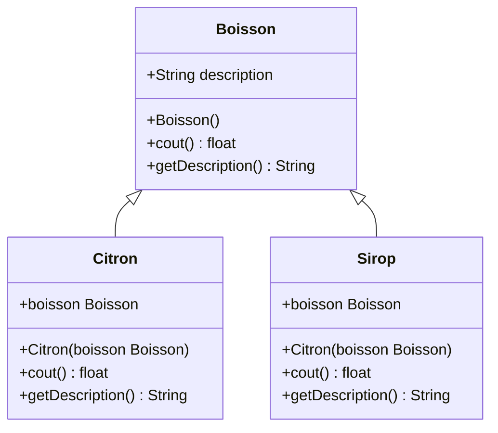
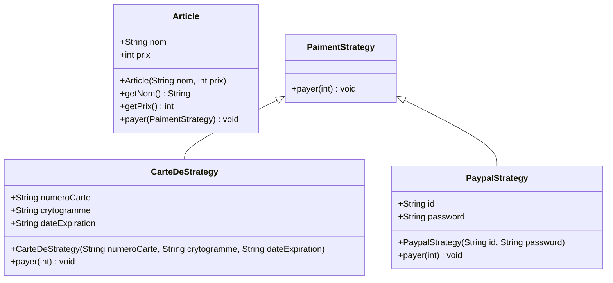

# Les modèles de conceptions décorateur et stratégie
***

## Définition
Un design pattern, également appelé patron de conception, 
représente une solution générale et réutilisable à des problèmes 
courants rencontrés lors de la conception logicielle. Ces modèles 
fournissent des approches éprouvées et structurées pour résoudre des 
problèmes spécifiques qui se présentent fréquemment au cours du 
développement de logiciels.


Ils sont essentiellement des modèles prédéfinis pour résoudre des
problèmes récurrents, offrant des solutions testées et éprouvées par le temps. 
Ces solutions sont formalisées de manière à pouvoir être utilisées dans 
différents contextes sans être spécifiquement liées à un langage de 
programmation ou à une technologie particulière.

***
## Utilité
Les design patterns représentent des solutions efficace face aux 
problèmes récurrents lors de la conception logicielle. Ils établissent un 
langage commun pour faciliter la communication entre les concepteurs et 
les développeurs, contribuant 
ainsi à renforcer la qualité, la maintenabilité et la flexibilité du code.
***
## Le patron de conception décorateur
### Définition
Le Décorateur représente un schéma de conception qui apporte de la flexibilité 
en ajoutant de nouvelles tâches à un objet en cours d'exécution. Cette méthode permet 
d'ajouter ou de retirer des fonctionnalités à un objet existant pendant que le programme 
fonctionne. Contrairement à l'approche traditionnelle d'héritage où les sous-classes 
élargissent une classe parente de manière fixe, le Décorateur offre une solution plus 
adaptable, échappant ainsi à une extension figée lors de la compilation.
***
### Avantages et capacités
Ce modèle, faisant partie des 23 patrons de conception présentés par le "Gang of Four" (GOF),
résout diverses difficultés cruciales dans le développement logiciel. Il autorise notamment 
la modification dynamique du comportement d'un objet en ajoutant des fonctionnalités 
supplémentaires sans altérer sa structure principale. Cette technique encourage la 
modularité et la réutilisation du code, évitant la multiplication de sous-classes.
***
### Stratégie et mise en oeuvre
La stratégie du Décorateur implique la création de nouvelles classes qui enveloppent 
l'objet original, offrant ainsi de nouvelles fonctionnalités à cet objet sans changer 
celles déjà existantes. Ces classes enveloppes, ou décorateurs, partagent une interface 
commune avec l'objet initial, autorisant ainsi leur utilisation de façon interchangeable. 
De plus, plusieurs décorateurs peuvent être ajoutés successivement pour enrichir 
graduellement et de manière organisée les fonctionnalités.
***
### Cas pratique
En pratique, le Décorateur trouve des applications variées dans le domaine de la 
programmation où la flexibilité et la modularité sont primordiales. Par exemple, 
dans le développement d'applications graphiques, il peut être utilisé pour ajouter 
en temps réel des éléments visuels tels que des bordures, des couleurs ou d'autres
attributs à un élément graphique existant, sans avoir besoin de créer de multiples 
sous-classes pour chaque configuration.
***
### Les bénéfices
En somme, le Décorateur se présente comme un schéma de conception robuste et adaptable 
permettant d'ajouter de nouvelles fonctionnalités à un objet en cours d'utilisation, offrant 
ainsi une alternative élégante et structurée à l'héritage statique pour améliorer les
fonctionnalités des logiciels. Son utilisation encourage la réutilisation du code, la 
clarté dans la conception et la facilité de maintenance des systèmes logiciels.
***
### Dans quel cas concret utilise-t-on ce patron de conception?

- Dans un jeu vidéo, le patron décorateur peut être utilisé pour ajouter des effets spéciaux à des objets du jeu. Par exemple, un décorateur peut ajouter une lueur à un objet, ou une explosion lorsque l'objet est détruit. 
- Dans une application de gestion de fichiers, le patron décorateur peut être utilisé pour ajouter des fonctionnalités de sécurité à des fichiers. Par exemple, un décorateur peut chiffrer un fichier, ou lui appliquer une politique d'accès.
- Dans une application web, le patron décorateur peut être utilisé pour ajouter des fonctionnalités de suivi à des pages web. Par exemple, un décorateur peut enregistrer les visiteurs d'une page, ou collecter des données sur l'utilisation de la page.

>Il peut être utilisé dans plusieurs autres cas...
### Exemple d'utilisation
Imaginons que nous ayons une classe *Boisson* qui représente différentes boissons gazeuses
avec des méthodes pour obtenir le coût et la description de chaque boisson.
#### Diagramme

#### Classes
```java
class Boisson(){
    private String description;
    
    public Boisson(){
        this.description = "Coca";
    }
    public float cout(){
        return 2.5;
    }
    public String getDescription(){
        return this.description;
    }
}
```

Maintenant, nous voulons ajouter des extras à ces Boissons comme un citron, du sirop ou 
des glaçons... sans modifier la classe Boissons de base à chaque fois.
C'est là qu'un décorateur entre en jeu. Créons des décorateurs pour chaque extra possible :
#### Décorateur Citron
```java
class Citron(){
    private Boisson boisson;
    
    public Citron(Boisson boisson){
        this.boisson = boisson;
    }
    public float cout(){
        return this.boisson.cout()+1.0;
    }
    public String getDescription(){
        return this.boisson.getDescription()+", Citron";
    }
}
```

#### Décorateur Sirop
```java
class Sirop(){
    private Boisson boisson;
    
    public Sirop(Boisson boisson){
        this.boisson = boisson;
    }
    public float cout(){
        return this.boisson.cout()+2.0;
    }
    public String getDescription(){
        return this.boisson.getDescription()+", Sirop";
    }
}
```

Maintenant pour utiliser ces décorateurs pour ajouter des extras à notre boisson
```java
public class main(){
    Boisson boisson = new Boisson();

// Ajout d'un décorateur Citron à notre boisson
    boisson = new Citron(boisson);

// Ajout d'un décorateur Sirop à notre boisson
    boisson = new Sirop(boisson);

// Obtention de la description de la boisson ainsi que du coût avec les extrats inclus
    System.out.println("Description: " + boisson.getDescription());
    System.out.println("Coût: " + boisson.cout());
}
```
Dans cet exemple, nous avons créé une **Boisson** de base puis nous lui avons ajouté 
successivement 2 décorateurs *(Citron et Sirop)*. Chaque décorateur enveloppe 
la **Boisson d'origine** et ajoute son propre coût et sa propre description à la boisson, 
ce qui permet ainsi de créer des combinaisons flexibles de fonctionnalités supplémentaires 
sans altérer la classe de base Boisson.

### Conclusion
Pour conclure, le patron de conception décorateur est un schéma de conception qui 
permet d'ajouter ou de retirer des fonctionnalités à un objet en cours d'exécution. 
Il est basé sur la création de nouvelles classes qui enveloppent l'objet original, 
offrant ainsi de nouvelles fonctionnalités à cet objet sans changer celles déjà existantes.

## Le patron de conception Stratégie
***
### Définition
Le patron de conception Stratégie est une structure qui permet de 
regrouper un algorithme dans un objet distinct, favorisant ainsi la 
*modularité* et la facilité d'évolution du logiciel en rendant l'algorithme interchangeable.

### Avantages et capacités
Le Strategy pattern offre une meilleure structuration du code en décomposant 
les modules et classes, facilitant ainsi la maintenance et le diagnostic.

Les modifications ont des répercussions limitées grâce à la segmentation du code, 
et l'interface conviviale permet une utilisation simple de différentes options.
De plus, la flexibilité du patron permet d'ajouter rapidement de nouvelles stratégies 
sans modifier le code existant. Cependant, sa complexité peut entraîner des redondances 
et des inefficacités de communication interne.
### Cas pratique
Le patron stratégie est souvent utilisé dans les cas suivants :

- Pour implémenter des fonctionnalités qui peuvent être réalisées de différentes manières. 
Par exemple, un jeu de cartes peut utiliser le patron stratégie pour implémenter le 
comportement des différentes cartes. Chaque carte peut avoir sa propre stratégie, qui 
définit comment elle est jouée.
- Pour personnaliser le comportement d'un objet en fonction du contexte. Par exemple, 
un système d'impression peut utiliser le patron stratégie pour implémenter différentes 
stratégies d'impression, telles que l'impression en noir et blanc, l'impression en couleur 
ou l'impression recto verso.
- Pour faciliter l'extension d'un système. Par exemple, un framework de développement 
d'applications web peut utiliser le patron stratégie pour implémenter différentes stratégies 
d'authentification, telles que l'authentification par mot de passe, l'authentification par 
jeton ou l'authentification par biométrie.

### Bénéfices
Le patron de conception Stratégie présente des avantages significatifs, 
notamment la flexibilité des algorithmes, la réduction de la duplication de code, 
la facilité des tests, la modularité, et la séparation des préoccupations. Il offre également 
une évolutivité aisée du logiciel, une réutilisation efficace des stratégies, et une diminution 
du couplage excessif entre le contexte et les différentes stratégies. En résumé, la Stratégie 
favorise une conception logicielle modulaire, flexible, et facile à entretenir.
### Problèmes
Il est important d'utiliser le patron avec précaution en raison de la dépendance étroite 
entre le client et les stratégies, ce qui le rend plus adapté aux modifications fondamentales 
dans le comportement du logiciel.

### Dans quel cas concret utilise-t-on ce patron de conception?
- Dans un **jeu vidéo**, le patron stratégie peut être utilisé pour implémenter le comportement des différents types d'ennemis. Par exemple, un ennemi peut avoir une stratégie d'attaque agressive, une stratégie d'attaque défensive ou une stratégie d'attaque furtive.
- Dans une **application de gestion de fichiers**, le patron stratégie peut être utilisé pour implémenter différentes stratégies de compression de fichiers. Par exemple, une application peut utiliser une stratégie de compression par défaut, une stratégie de compression rapide ou une stratégie de compression maximale.
- Dans un **système de comptabilité**, le patron stratégie peut être utilisé pour implémenter différentes stratégies de calcul des taxes. Par exemple, une entreprise peut utiliser une stratégie de calcul des taxes par défaut, une stratégie de calcul des taxes pour les entreprises internationales ou une stratégie de calcul des taxes pour les entreprises locales.

> Il peut être utilisé dans plusieurs autres cas...

### Exemple d'utilisation
Imaginons une expérience sur un site d'e-commerce : vous choisissez un produit, l'ajoutez au 
panier, puis, lors de la vérification, le site vous invite à "payer". Bien que cette action 
semble abstraite, les multiples façons de réaliser le paiement, que ce soit par carte, Paypal, 
ou d'autres méthodes, démontrent l'utilité du Pattern Strategy.
#### Diagramme 

#### Classes
Interface "PaiementStrategy"
```java
public interface PaiementStrategy {
    public void payer(int montant);
}
```
Class "PaypalStrategy" qui implémente "PaiementStrategy"
```java
public class PaypalStrategy implements PaiementStrategy{

    private String id;
    private String password;

    public PaypalStrategy(String email, String pass){
        this.id=id;
        this.password=pass;
    }

    @Override
    public void payer(int montant) {
        System.out.println(montant + "€ payés par Paypal.");
    }

}
```
Class "CarteDeCreditStrategy" qui implémente "PaiementStrategy"
```java

public class CarteDeCreditStrategy implements PaiementStrategy {

    private String numeroCarte;
    private String cryptogramme;
    private String dateExpiration;

    public CarteDeCreditStrategy(String num, String crypto, String date) {
        this.numeroCarte = num;
        this.cryptogramme = crypto;
        this.dateExpiration = date;
    }

    @Override
    public void payer(int montant) {
        System.out.println(montant + "€ payés par carte de crédit.");
    }

}
```
Class "Article"
```java
public class Article {

    private String nom;
    private int prix;

    public Article(String nom, int prix) {
        this.nom = nom;
        this.prix = prix;
    }

    public String getNom() {
        return this.nom;
    }

    public int getPrix() {
        return this.prix;
    }

    public void payer(PaiementStrategy methode){
        int montant=this.getPrix();
        methode.payer(montant);
    }
}
```

### Conclusion
Pour conclure, le patron de conception "Stratégie" offre une approche modulaire et flexible 
pour gérer des algorithmes interchangeables dans un système. En favorisant la réutilisation du 
code, la facilité de test, et la séparation des préoccupations, il contribue à la conception de 
logiciels évolutifs, modulaires et maintenables. La "Stratégie" s'avère particulièrement utile 
lorsque des algorithmes variés doivent être appliqués de manière interchangeable dans un 
contexte donné.

***
## Source
- Wikipédia
  - Décorateur: https://fr.wikipedia.org/wiki/D%C3%A9corateur_(patron_de_conception)
  - Stratégie: https://fr.wikipedia.org/wiki/Strat%C3%A9gie_(patron_de_conception)
  - Patron de conception (en général): https://fr.wikipedia.org/wiki/Patron_de_conception
- Design-Pattern
  - Décorateur: https://design-patterns.fr/decorateur
- Refactoring
  - Stratégie: https://refactoring.guru/fr/design-patterns/strategy
- CodinGame
  - Stratégie (exemple d'utilisation): https://www.codingame.com/playgrounds/10741/design-pattern-strategy
- Bard
  - Reformulation/Embellissement des phrases
  - Demandes de sources pour les recherches
  - Explications
- ChatGPT
  - Reformulation/Embellissement des phrases
  - Demandes sur quelques points
  - Explications
- IONOS
  - (image): https://www.ionos.fr/digitalguide/sites-internet/developpement-web/les-design-patterns-quest-ce-que-cest/